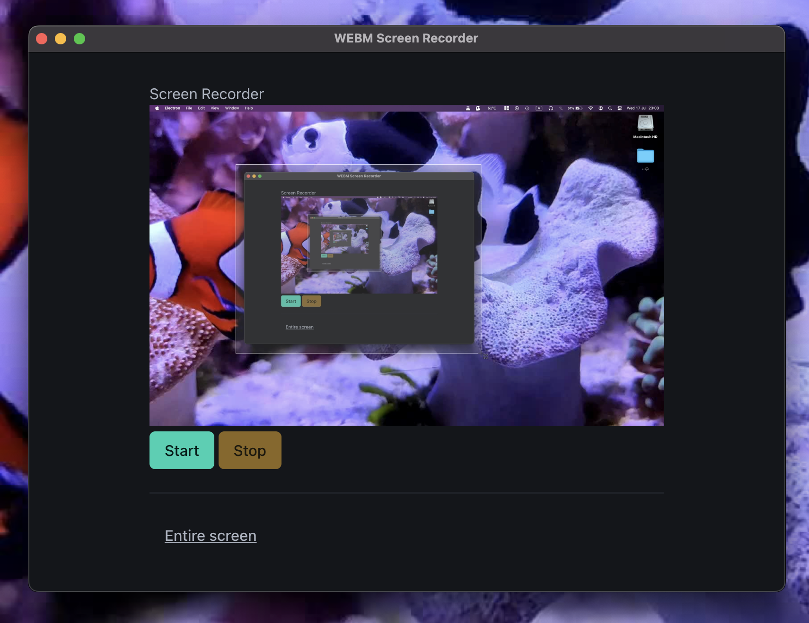

# Screen Recorder Electron App

## Description

This is an Electron-based desktop application that allows users to record their screen or specific application windows. The app provides a simple interface for selecting the video source, starting and stopping the recording, and saving the recorded video to a file.

## Features

- Select video source (screen or specific window)
- Start and stop recording
- Save recorded video as a WebM file
- User-friendly interface

## Installation

1. Clone this repository
2. Navigate to the project directory
3. Install dependencies:
4. Start the application:

## Usage

1. Click the "Choose a Video Source" button to select the screen or window you want to record.
2. Once a source is selected, click the "Start" button to begin recording.
3. Click the "Stop" button to end the recording.
4. Choose a location to save your recorded video file.

## Dependencies

- Electron
- @electron/remote

## Development

This app uses Electron for the desktop application framework. The main process is responsible for creating the application window and handling the app lifecycle, while the renderer process manages the user interface and recording functionality.

### Main Process (`main.js`)

- Sets up the Electron app and creates the main window
- Configures window properties and loads the HTML file
- Handles app events like 'ready' and 'window-all-closed'

### Renderer Process

- Manages the UI elements and user interactions
- Uses the `desktopCapturer` API to get available video sources
- Implements the recording functionality using the `MediaRecorder` API
- Handles saving the recorded video to a file

## License

[MIT License](LICENSE)

## Contributing

Contributions are welcome! Please feel free to submit a Pull Request.